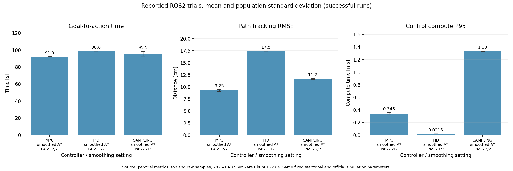
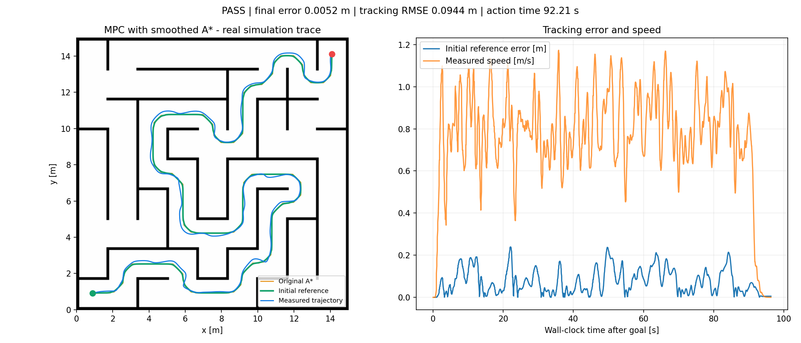

# RM navigation final project

Ubuntu 22.04 / ROS 2 Humble 下的固定迷宫单次点击导航。保留课程的双层行为树，补齐工程配置，实现 PID、带输入延迟补偿的线性 MPC，以及独立的平滑采样预测实验控制器。

作者账号：`sutinah12-hash`。提交分支：`nav`。官方来源：[TongjiSuperPower/sp_vision_tutorial_27 / final_project_nav](https://github.com/TongjiSuperPower/sp_vision_tutorial_27/tree/final_project_nav)，本次核对版本 `05c33fc8aa6695e76bcff310b42f8fdfe276e1cb`。

[原始作业要求](docs/assignment.md) · [运行步骤](docs/run_guide.md) · [架构与面试讲解](docs/architecture_guide.md) · [MPC 详细讲解](docs/mpc_explained.md) · [三种控制方法](docs/controller_methods.md) · [开发与失败记录](docs/implementation_status.md)

**当前四段实录：**[默认 MPC](docs/evidence/final_visible_mpc_rviz_01/rviz_one_click.mp4) · [PID](docs/evidence/final_visible_pid_rviz_01/rviz_one_click.mp4) · [Sampling](docs/evidence/final_visible_sampling_rviz_01/rviz_one_click.mp4) · [Fast MPC](docs/evidence/final_visible_fast_mpc_rviz_01/rviz_one_click.mp4)。四段均在 VMware 的真实 RViz 窗口连续录制，通过同一个精确目标按钮只发布一次 `(14.1, 14.1)`；画面中可直接看到 R1、R2、R3 的彩色车体、朝向和标签。

[四种控制配置的录像与指标](docs/video_comparison.md)：地图、三台机器人、代价地图参数、起终点和 RViz 显示完全一致。

**快速 MPC 参数实验：**速度上限 2.0 m/s、最大加速度 2.0 m/s²、制动加速度 1.2 m/s²、横向加速度 1.0 m/s²。完整 RViz 单击试验用时 **90.37 s**，终点误差 **0.91 cm**，最小墙距 **0.55 m**。它只改学生控制器参数，作为速度优先实验单独保留。

## 1. Task and compliance

固定起点 `(0.900, 0.900)`，固定终点 `(14.100, 14.100)`。一次目标通过上层 `click_nav.xml` 触发导航 action，再由下层 `default_nav_with_fallback.xml` 调用 A* 和控制器。没有绕过双层行为树，没有人工发布速度，没有拖动机器人或途中改目标。

原来的 lecture1–5 和个人仓库历史保留；导航源码在 `src/`。虚拟机使用独立的 `/home/zrj/nav_final_project`，不覆盖此前课程工作区。所有跟踪文件名使用 ASCII。

## 2. Run it

在已经安装完成的 VMware **Ubuntu 桌面终端**运行：

```bash
cd /home/zrj/nav_final_project
source /opt/ros/humble/setup.bash
source install/setup.bash
python3 scripts/run_trial.py --controller mpc --out results/my_mpc_01
```

等待 RViz 的 `One-click navigation` 按钮就绪，点击一次 `Navigate once: (14.100, 14.100)`。主办方原有的 `2D Goal Pose` 工具仍保留；正式固定终点实验用按钮保证四组目标完全相同。不要使用 `2D Pose Estimate` 或重复发目标。结束后 `data/metrics.json` 给出到达判定，`samples.csv` 保存原始采样，`trajectory.png` 为真实数据生成的轨迹图。重新运行时使用新的输出目录名称。

换控制器只改参数：`--controller pid` 或 `--controller sampling`。每次等待上一轮结束，不同时运行多套仿真。

全新克隆、依赖安装、编译和常见问题见 [run guide](docs/run_guide.md)。编译测试命令：

```bash
source /opt/ros/humble/setup.bash
colcon build --base-paths src --symlink-install --executor sequential --cmake-args -DCMAKE_BUILD_TYPE=Release -DBUILD_TESTING=ON
source install/setup.bash
colcon test --base-paths src --executor sequential
colcon test-result --verbose
```

## 3. How the project works

`RViz 单次目标 → 上层决策 BT → NavigateToPose action → 下层导航 BT → A* / controller plugin → 仿真反馈`

- `/global_costmap`：地图服务器发布的全局膨胀代价地图。
- `/local_costmap/costmap`：包含附近动态占据；`/robots → robot_marker_publisher → /dynamic_obstacles/markers` 把三台机器人的实测位姿显示为 R1、R2、R3。该支路只负责显示，不参与规划或控制。
- `/global_path_raw` / `/global_path`：原始 A* / 安全平滑后的路径。
- `/Odometry` 和 TF：定位与速度反馈；固定 `map → lidar_odom` 平移由原版仿真提供。
- `/sentry/cmd_vel`：控制器转换到旋转的 `base_link` 后输出的速度。
- `/mpc_prediction` / `/executed_path`：预测轨迹 / 测得的执行轨迹。
- `/controller_compute_ms`：控制回调自身计算耗时，不等于全系统 CPU 使用率。

配置集中在 `src/sp_nav_bringup/config/nav_params.yaml`；一键组合启动在 `project.launch.py`。代价地图的 `robot_radius=0.25`、`margin=0.05`、`d_safe=0.70`、`w=12.0` 和 `unknown_as_obstacle=false` 与主办方仿真配置一致。控制器实现 `configure`、`setPlan`、`computeVelocityCommands`，通过 pluginlib 注册，不改只读接口。完整数据流见 [architecture guide](docs/architecture_guide.md)。

## 4. Planner and smoothing

A* 在膨胀代价地图上搜索，并禁止对角穿过障碍角。将确切起终点保留下来，对中间点进行弹性平滑：兼顾不偏离原路径和减小二阶差分，每点位移限制为 0.20 m，最多 120 轮。

每次候选调整均检查代价和相邻线段；采用精确线段与障碍格矩形相交检测，避免稀疏采样漏掉角落。端点固定，最终整段复检；不安全则回退原路径。路径参考还包含曲率限速和终点制动剖面。

这验证的是参考路径的安全性，不等于有限误差跟踪下的整机安全保证。实际运行还需要观察轨迹与墙面净空。

## 5. Controllers

**PID baseline**：路径切向速度前馈，加最近投影点横向位置反馈、积分限幅和速度反馈。接近终点后使用无前馈阻尼位置调节，防止绕终点振荡。基线进行了实际调试，不以早期明显未完成的 PID 作为唯一对照。

**Delay-compensated linear MPC (default)**：状态为世界坐标 `px, py, vx, vy`，输入为期望速度 `ux, uy`。模型：

```text
alpha = exp(-dt / tau)
v[k+1] = alpha*v[k] + (1-alpha)*u[k]
p[k+1] = p[k] + dt*v[k+1]
```

从课程原版动力学的固定朝向阶跃响应拟合得到延迟约 0.2147 s、时间常数约 0.3145 s。使用 28 步、0.07 s 预测间隔，前 3 步由已发送命令固定，滚动优化剩余指令。位置、速度、指令变化和幅度构成凸二次代价；输入合速度圆盘约束通过投影加速梯度求解，最多 100 次迭代。严格说这是带二次约束的凸优化，并非完整非线性 MPC。

**Smooth sampling predictive (experimental)**：同样的参考路径和延迟队列，评估 257 条平滑扰动序列、3 轮加权更新，并在预测中考虑速度与加速度限幅。它是受 MPPI 启发的实验实现，与 Nav2 MPPI / SVG-MPPI 的差异见 [controller methods](docs/controller_methods.md)，运行时不会回退到 MPC。

三者共同的指令速度上限为 1.25 m/s，最终指令变化限幅为 1.7 m/s²。这些是学生控制器配置，未改原版仿真器的物理上限。MPC 的最终变化限幅未完整建模到优化约束中，是已知近似。

## 6. Evidence and evaluation

测试环境：VMware Ubuntu 22.04，8 vCPU / 8 GB RAM，系统 Python 3.10、ROS 2 Humble，Release 编译。最终四段 RViz 对照使用相同地图、三台机器人、仿真参数、代价地图、起终点与显示配置，只切换控制器及明确标注的 Fast MPC 控制器参数。

统计依据是每轮保留的原始日志、路径、时间序列和 `provenance.json`，而非截图估算。评测规则：

- 目标恰好一条，起点偏差小于 0.03 m，目标是指定坐标。
- ROS navigation action 成功后，再等待 4 秒，终点误差小于 0.05 m、速度小于 0.08 m/s 才记为 PASS。
- 耗时为接收目标到 action 成功的墙钟时间；终点误差是上述等待后的值，两者不混淆。
- 跟踪误差是实测位置到**首次全局参考路径线段**的最近距离，冻结参考避免重规划造成误差虚低。
- 静态墙净空是中心到占据像素的近似距离，不冒充仿真器直接提供的碰撞计数。
- 失败试验保留，均值只汇总成功试验并同时展示通过次数。小样本不能证明普遍最优或稳定性。

逐轮证据位于 [docs/evidence](docs/evidence)，可使用 `scripts/summarize_trials.py` 从所列试验目录重新计算汇总。自动回归的 `trigger=single_topic_message_test`，GUI 验收的 `trigger=rviz_click`，不会把自动发布目标说成手工点击。

编译结果：9 个包成功；`colcon test-result` 汇总 21 项检查，0 errors、0 failures、0 skipped。仿真采样等价测试覆盖 190 个案例、506861 个格子，并验证未修改文件哈希。

### Repeated controller comparison

同版本无界面对照，三种控制器各 2 轮：

- **MPC：2/2 通过。**成功轮平均耗时 91.91 s，终点误差 5.92 mm，跟踪 RMSE 9.25 cm，控制计算 P95 平均 0.345 ms。
- **PID：1/2 通过。**成功轮耗时 98.76 s，终点误差 11.06 mm，跟踪 RMSE 17.45 cm，计算 P95 0.0215 ms；另一轮转弯后导航 action 中止，记录至 240 s 超时，不能从结果中删除。
- **平滑采样：2/2 通过。**成功轮平均耗时 95.45 s，终点误差 24.52 mm，跟踪 RMSE 11.66 cm，计算 P95 平均 1.334 ms。

这组有限样本里，MPC 的到达、跟踪和耗时优于这里实现的 PID，代价是更高计算量；采样实验可运行，但暂未胜过 MPC，所以不把“更新”写成“全面更优”。默认仍选择 MPC。2 轮不构成统计显著性或长期可靠性证明。





### Smoothing ablation

固定首次参考路径均为 914 个点。平滑前后路径长度约 50.97 / 49.30 m，相邻转角平方和从 59.94 降至 3.91 rad²，最大相邻转角从 0.785 降至 0.189 rad。这是当前采样密度下的形状指标，不是与采样密度无关的曲率积分。

MPC 关闭平滑的单轮也通过：123.87 s、终点误差 7.32 mm、跟踪 RMSE 6.78 cm。平滑后的两轮更快，但相对各自参考线的误差反而更大，因此不能宣传平滑让所有指标都同时改善。该消融只有一轮，受速度剖面和 VM 调度影响。

### Current RViz runs

四轮都在完整主办方 RViz 配置上运行：Grid、全局/局部代价地图、Path、LocalPath、规划标记、TF、动态障碍、点云和原控制器标记均保留；原始 A*、执行轨迹、预测轨迹、机器人坐标轴和目标箭头作为附加显示。仿真日志均启动 `robots=[1, 2, 3]`。`robot_marker_publisher` 订阅主办方已有的 `/robots`，仅把三台机器人的位姿画成青色 R1、绿色 R2、红色 R3，并不改变仿真状态、代价地图或控制结果。

|配置|结果|Action 时间|终点误差|跟踪 RMSE|最小墙距|视频长度|
|---|---:|---:|---:|---:|---:|---:|
|默认 MPC|PASS|96.38 s|0.84 cm|10.60 cm|0.60 m|104.9 s|
|PID|FAIL|240 s 超时|824.32 cm|35.93 cm|0.35 m|245.7 s|
|Sampling|PASS|97.58 s|2.78 cm|12.65 cm|0.50 m|107.4 s|
|Fast MPC|PASS|90.37 s|0.91 cm|11.18 cm|0.55 m|100.0 s|

四轮都来自干净提交 `3b9ea6c`，`metrics.json` 记录 `trigger=rviz_click`、`goal_messages=1`、起点 `(0.9, 0.9)` 和终点 `(14.1, 14.1)`。三轮成功的 `action_status=4`；PID 在同一路段停止并以 `action_status=2` 记录至 240 秒超时。视频均为 1600×1016、H.264、10 fps 的原速连续窗口捕获，已完整解码检查；每个目录另存视频 20 秒处的实际画面。


旧版录屏和早期失败轮仍保存在 `docs/evidence/`，用于回看调试过程；上表四轮是当前配置的最终对照。

## 7. Reproduce and extend

自动重复回归（不替代 GUI 单次点击验收）：

```bash
python3 scripts/run_trial.py --controller mpc --headless --auto-goal --out results/test_mpc_01
python3 scripts/run_trial.py --controller pid --headless --auto-goal --out results/test_pid_01
python3 scripts/run_trial.py --controller sampling --headless --auto-goal --out results/test_sampling_01
python3 scripts/run_trial.py --controller mpc --no-smoothing --headless --auto-goal --out results/test_raw_01
python3 scripts/verify_sampling_equivalence.py --out results/test_equivalence_01
```

每轮 `provenance.json` 记录提交号、工作区状态、参数与开始时间。`build/`、`install/`、`log/`、完整开发期 `results/` 均忽略；只将经检查的最终证据复制到 `docs/evidence/`。不提交凭据、代理订阅或无关个人文件。

后续可以研究更完整的非线性模型、带障碍代价的采样控制或自适应辨识，但尚未实现的内容不算当前成果。当前优化器不直接约束所有障碍，不能用于未经额外安全验证的真实车自主驾驶。
