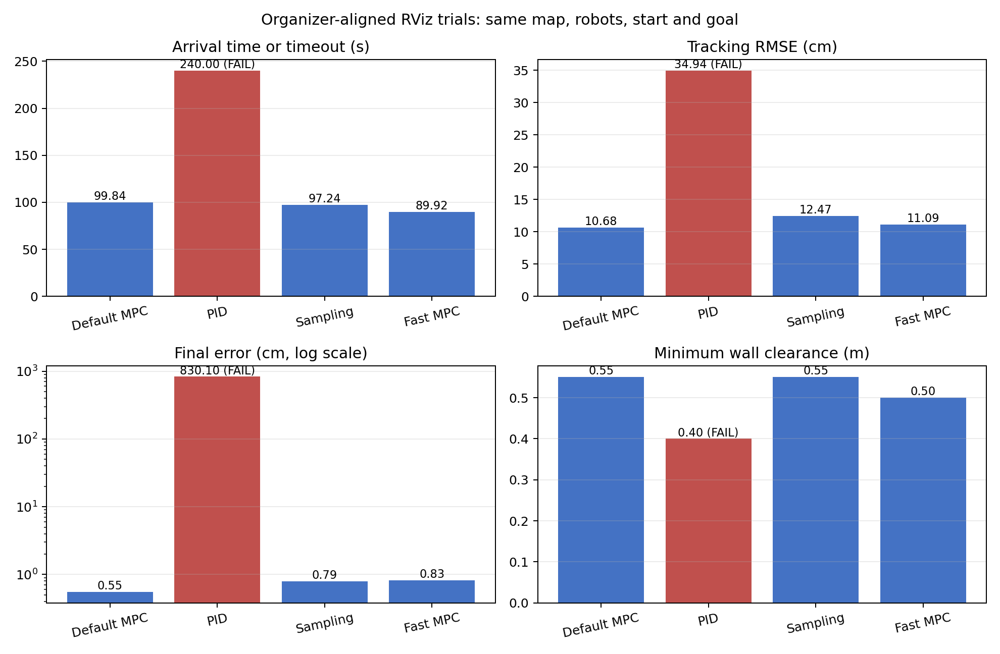

# RViz controller videos

四段最终录像都来自 VMware Ubuntu 22.04 的真实 RViz 窗口。每轮从固定起点 `(0.9, 0.9)` 出发，只点击一次精确目标按钮发布 `(14.1, 14.1)`，随后经过上层行为树、NavigateToPose action、下层行为树、A* 和控制器到达终点。

## Videos

- [Default MPC](evidence/final_aligned_mpc_rviz_01/rviz_one_click.mp4)：PASS，99.84 s 到达，终点误差 0.55 cm，跟踪 RMSE 10.68 cm，最小墙距 0.55 m。
- [PID](evidence/final_aligned_pid_rviz_01/rviz_one_click.mp4)：FAIL，在 `(11.41, 6.25)` 附近停止，240 s 超时，跟踪 RMSE 34.94 cm。
- [Sampling](evidence/final_aligned_sampling_rviz_01/rviz_one_click.mp4)：PASS，97.24 s 到达，终点误差 0.79 cm，跟踪 RMSE 12.47 cm，最小墙距 0.55 m。
- [Fast MPC](evidence/final_aligned_fast_mpc_rviz_01/rviz_one_click.mp4)：PASS，89.92 s 到达，终点误差 0.83 cm，跟踪 RMSE 11.09 cm，最小墙距 0.50 m。

## What stayed the same

- 主办方迷宫地图与三台机器人；
- 仿真速度、加速度、频率、碰撞模型和起始位置；
- 全局代价地图参数与主办方机器人参数；
- A*、路径平滑、两层行为树和固定终点；
- 完整主办方 RViz 显示配置。

RViz 保留 Grid、全局/局部 Map、Path、LocalPath、规划 Marker、TF、动态障碍 MarkerArray、PointCloud2 和原控制器 Marker；之后只附加原始 A*、执行轨迹、预测轨迹、机器人坐标轴、目标箭头和精确目标面板。

## What changed

前三轮只切换 `controller` 插件。Fast MPC 仍使用 MPC 插件，但把学生控制器的速度上限、最大加速度、制动加速度和横向加速度分别设为 `2.0 m/s`、`2.0 m/s²`、`1.2 m/s²`、`1.0 m/s²`。仿真器的 `v_max=2.0 m/s` 与 `a_max=2.0 m/s²` 没有改动。

## How to read the numbers

Action 时间从记录器收到目标开始，到 NavigateToPose 返回成功为止；成功视频在点击前提前开始，并在成功后保留停车画面，所以视频长度比 Action 时间多约 9–11 秒。PID 没有成功时间，记录器在 240 秒判定超时；录像连续保留前 200 秒，已经覆盖机器人停止后的长时间静止过程。

跟踪 RMSE 是实测位置到首次参考路径线段的最近距离。最小墙距是机器人中心到静态占据像素的近似距离；它用于横向比较，不冒充仿真器直接给出的碰撞计数。默认 MPC、Sampling 和 Fast MPC action 成功且最终速度接近零；PID 失败记录保留在成功率中。

默认 MPC 在三种成功方案中跟踪误差最小，并保留 0.55 m 最小墙距，适合作为主方案。Sampling 在本轮稍快，但误差更大；PID 虽然计算最简单，却在相同路段重复卡住，不作为可交付控制器；Fast MPC 最快，同时比默认 MPC 增加了跟踪误差，因此作为速度实验单独展示。

每个目录都保留 `metrics.json`、`samples.csv`、参考路径、计算耗时、启动日志、录像命令元数据和 MP4。录像均为 1600×1016、H.264、10 fps、原速连续录制，无拼接和加速。旧录像继续保存在 `docs/evidence/`，但不再作为当前配置的最终对照。
