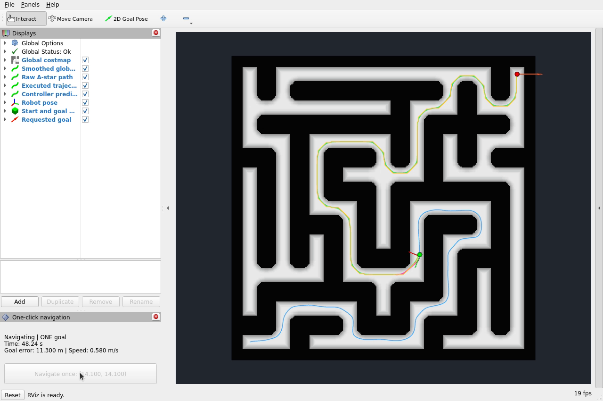

# Native RViz controller videos

三个控制器均在 VMware Ubuntu 22.04 中真实运行：点击一次 RViz 固定目标按钮，经原有双层行为树导航，到达后停车。录像原速、连续、无剪接；不是从 CSV 生成的动画。

## Sampling with raw A-star overlay

[最新采样控制器视频：开启原始 A* 路径](evidence/final_sampling_rviz_06/rviz_one_click.mp4)。本轮 PASS，导航 **98.75 s**，视频 **107.3 s**，最终误差 **1.38 cm**，跟踪 RMSE **9.68 cm**。源码版本 `8cf53c5`；相对先前三段录像只改 RViz 显示配置，没有调整算法、仿真器或参数。参考路径哈希也与前三轮相同。



- 橙黄色 `Raw A-star path`：平滑前的 A* 路径，话题 `/global_path_raw`。
- 绿色 `Smoothed global path`：平滑后的参考路径，话题 `/global_path`。
- 蓝色 `Executed trajectory`：实际执行轨迹。
- 粉色 `Controller prediction`：控制器预测轨迹。

原始路径线宽 0.04 m，平滑路径线宽 0.05 m。只在 RViz 中给橙色线增加 `Offset Z = 0.03`，避免与地图共面遮挡；没有更改发布的路径坐标，X/Y 显示偏移均为零。直线段基本重合，在拐角处更容易看出折线与平滑曲线的差别。规划器会更新当前位置之后的路径，因此到达时绿色/橙色路径可能只剩终点附近一小段；完整走过的轨迹由蓝色线保留。

该视频用于展示路径图层，不替换首轮对比数据；显示配色不影响算法性能。

### Display troubleshooting retained

- `final_sampling_rviz_02`：101.41 s，导航 PASS，但橙色路径不清楚，因此不是推荐的路径对照视频。
- `final_sampling_rviz_03`：99.52 s，导航 PASS，原生窗口画面有黑块、地图动态内容未正常刷新。
- `final_sampling_rviz_04`：102.48 s，导航 PASS，调整窗口尺寸后 UI 重绘，但动态地图仍未正常刷新。
- `final_sampling_rviz_05`：101.40 s，导航 PASS；检查 ROS 订阅正常，途中切换显示项并重置 RViz 显示缓存，末段恢复。它是诊断录像，不作为完整正常展示。
- `final_sampling_rviz_06`：开始导航前点击 RViz 左下角 `Reset` 清理显示缓存，再开始录屏并点击一次固定目标。完整录像检查到橙色、绿色、蓝色与预测轨迹均正常更新。未使用 `2D Pose Estimate`，未重置机器人、重发目标或发送额外速度指令。

这些轮次均保留日志、原始数据和原生录像，不能将“指标 PASS”直接当成“视频展示合格”。目前验证了显示缓存重置可恢复刷新，尚未证明底层图形异常的唯一根因。上述显示排查轮次不加入无界面控制器对照均值。

## First matched-display recordings

下面三段采用相同的 RViz 显示配置：1280×850、H.264、10 fps。固定起点 `(0.9, 0.9)`、终点 `(14.1, 14.1)`；地图、动力学、频率参数、规划器和控制器参数未因录像改变。

- [Linear MPC video](evidence/final_mpc_rviz_04/rviz_one_click.mp4)：导航 **97.35 s**，视频 **107.5 s**，最终位置误差 **1.19 cm**，全程路径跟踪 RMSE **8.21 cm**。PASS。
- [PID video](evidence/final_pid_rviz_01/rviz_one_click.mp4)：导航 **103.70 s**，视频 **112.6 s**，最终位置误差 **1.06 cm**，全程路径跟踪 RMSE **16.41 cm**。PASS。
- [Smooth sampling video](evidence/final_sampling_rviz_01/rviz_one_click.mp4)：导航 **102.01 s**，视频 **110.1 s**，最终位置误差 **0.56 cm**，全程路径跟踪 RMSE **10.10 cm**。PASS。

“Smooth sampling” 是受 MPPI 启发的平滑采样预测实验控制器，不等同于完整标准 MPPI 或 Nav2 MPPI。每轮实际插件由各目录的 `launch.log` 确认。旧视频左侧统一的 `MPC prediction` 是显示项名称，不能据此认定加载的是 MPC；新的配置改称 `Controller prediction`，话题不变。

MPC 录像运行源码为 `8872af1`，PID 与 sampling 为 `b4caec9`；两版本的 `src/` 无差异，后者只补文档和证据。三份初始参考路径 CSV 的 SHA-256 完全相同：

```text
ed14b49eee4391b13130a24a5438c5ae3a8a73c22041c2dd182c842659d4e144
```

## Why is the recorded run slower?

首先区分两种时间：

1. **导航耗时**：`scripts/evaluate_run.py` 使用 `time.monotonic()`，从记录器收到目标至收到 action 成功状态，计算实际经过时间。例如 PID 的 103.70 s。
2. **视频总长**：还含点击前约 2 s、成功后的约 4 s 停车观察，以及收尾画面。例如同一 PID 视频共 112.6 s。视频总长不是成绩。

此前无界面对照见 [原始汇总](evidence/comparison/summary.json)：

- MPC：两次成功平均 **91.91 s**；本次 GUI 录像 **97.35 s**，约增加 **5.9%**。
- PID：两次中只有一次成功，该次 **98.76 s**；本次 GUI 录像 **103.70 s**，约增加 **5.0%**。另一次失败仍保留，不能称为两次成功平均。
- Sampling：两次成功平均 **95.45 s**；本次 GUI 录像 **102.01 s**，约增加 **6.9%**。

两组运行负载不同：后者多了可见 RViz 的地图、路径和状态绘制，以及 FFmpeg 屏幕采集和编码；宿主机与虚拟机的 CPU 调度也会波动。

仿真源码中有一个重要机制：`sim_robot.py` 以 `dt = 1 / sim_hz` 积分，本配置为 `1/30 s`；`sim_gui.py` 的每次 `tick()` 推进机器人一步、绘制，再调用 `clock.tick(30)`。这个 30 是目标帧率限制，不能保证繁忙时每个真实秒都执行 30 步；循环变慢时也没有按真实时间补齐多个物理步。因此，即使所有频率参数原封不动，实际计算负载仍可能延长墙钟时间。反馈和控制回调的调度差异还会影响实际轨迹与收敛过程。

**这是源码支持的可能机制，不是已测定的录屏开销比例。** 目前没有做“无界面 / 有界面不录屏 / 有界面录屏”随机顺序的多轮成对试验，也没有记录每一物理步的真实频率。不能把约 5%～7% 的差值全部归因于录像；记录器的 odometry 接收频率也不等于物理推进频率。

若要求以实际 GUI 演示计时，就应报告 GUI 这一轮的耗时，不能用较快的无界面数字替换。三种控制器的单轮录像便于观察，不足以证明普遍的性能排序；每个指标也可能有不同赢家。

## Evidence and reproduction

每轮目录均保留 `provenance.json`、`launch.log`、`recorder.log`、`data/metrics.json`、原始 CSV、视频编码 JSON，以及从同一视频解码的起始、中途、到达帧。`final_error_m` 是成功后停车观察结束时的位置误差，而非误差曲线的全程均值。

在虚拟机桌面终端启动下一轮，输出目录必须使用新名称：

```bash
cd /home/zrj/nav_final_project
source /opt/ros/humble/setup.bash
source install/setup.bash
python3 scripts/run_trial.py --controller sampling --out results/my_sampling_01
```

换成 `--controller mpc` 或 `--controller pid` 可运行另两种；不要并行启动多套仿真。待按钮就绪后只点击一次。检查已提交证据：

默认已勾选原始 A* 图层。如果 RViz 状态面板数值变化但地图画面不更新，可以在发目标前点击 RViz 左下角 `Reset` 重置显示缓存；这不是机器人复位按钮。不在导航途中改目标或用 `2D Pose Estimate`。

```bash
python3 scripts/validate_evidence.py
```
