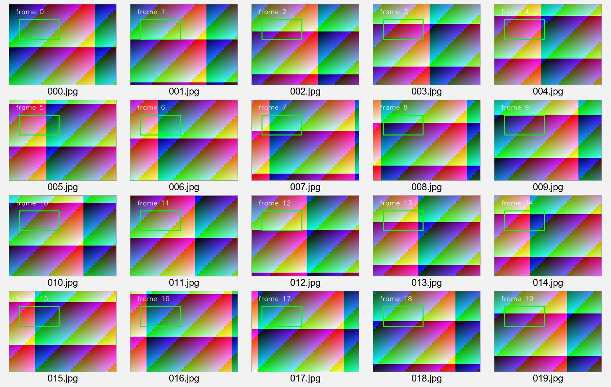

# Lecture3 所学总结：现代 C++ 并发视觉流水线

## 1. 作业目标

本次作业要求每个输入帧：

1. 恰好被生产一次；
2. 恰好被一个 Worker 处理和保存一次；
3. 处理前图像内容不被后续采集覆盖；
4. 多线程统计保持正确；
5. 显式 `wait()` 或直接析构时都能安全退出。

```text
ImageSequenceSource -> BlockingQueue<Frame> -> 多个 Worker -> ImageProcessor -> output/*.jpg
```

## 2. 我修复的核心问题

### 2.1 `cv::Mat` 的共享内存

普通 `cv::Mat` 赋值通常只复制矩阵头。相机复用内部缓冲区时，队列中的旧帧可能随下一次采集一起改变。因此使用：

```cpp
frame.image = buffer_.clone();
```

这让每帧拥有独立的像素存储，校验和测试也能证明旧帧没有被后续采集修改。

### 2.2 移动语义

```cpp
queue_.push(std::move(frame));
```

`clone()` 负责让像素所有权独立，`std::move` 负责降低之后在线程之间传递对象的成本，两者解决的问题不同。

### 2.3 统计线程安全

多个 Worker 会同时更新统计量。所有更新和 `snapshot()` 都由同一个互斥锁保护，既防止自增丢失，也确保快照中的四个值属于同一一致状态。

`snapshot()` 是 `const`，但读取时仍要加锁，因此互斥锁声明为：

```cpp
mutable std::mutex mutex_;
```

### 2.4 队列关闭协议

生产者完成后调用 `queue_.close()`：

- 队列中剩余帧仍会被处理；
- 队列关闭且耗尽后，`pop()` 返回 `false`；
- 等待中的 Worker 被全部唤醒并退出。

没有关闭协议时，Worker 会永久等待，主线程也会卡在 `join()`。

### 2.5 线程生命周期

`Pipeline::~Pipeline()` 调用 `wait()`，保证对象销毁前回收线程。`wait()` 检查 `joinable()`，所以重复调用安全。

`start()` 使用 `started_` 防止重复启动；如果创建线程期间发生异常，则关闭队列、回收已创建线程并重新抛出异常。

## 3. 为什么满足“恰好一次”

- 一个队列元素只能被一次 `pop()` 移除；
- 所有 Worker 共享同一个受锁保护的队列；
- 每帧拥有唯一递增 ID；
- 最终检查 `produced == processed == saved`；
- `corrupted == 0` 证明帧内容没有被修改。

## 4. 自动检查结果

```bash
cd lecture3/hw
bash zrj验证.sh
```

重新运行结果：

- `frame_integrity_test`：通过；
- `statistics_test`：通过；
- `pipeline_test`：通过；
- `shutdown_test`：通过；
- 2、3、6 个 Worker：全部通过；
- `report.md`：通过；
- 总结果：`ALL TESTS PASSED`。

- [原始自动检查日志](docs/evidence/zrj_lecture3_check.txt)
- [可复现验证脚本](zrj验证.sh)

程序实际生成的20帧结果如下。这是算法输出图片：



## 5. 我的收获

- RAII 不只管理内存，也可以管理线程生命周期；
- 所有权独立与高效传递需要分别考虑；
- 条件变量解决“什么时候继续”，互斥锁解决“谁能同时访问”；
- 并发正确性要通过校验和、计数不变量和不同线程数量反复验证；
- 正确退出与正确处理数据同样重要。

